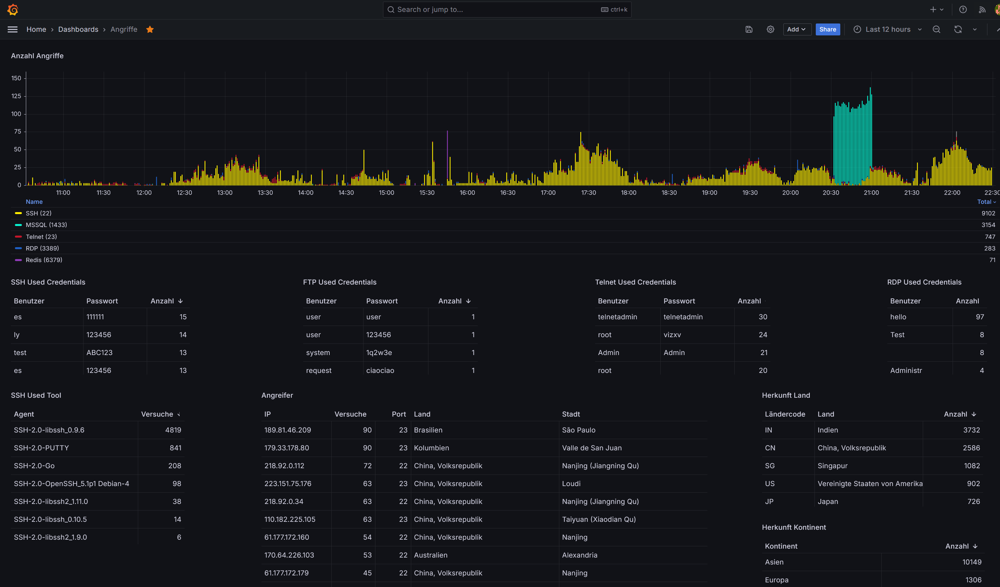

## Honeypot with Grafana

---

### Installation

* run ```make install``` to copy the configuration file to opencanary and build the Docker container
* run ```make up``` to run the Docker container
* open the following ports, if you want that the fake service is available from the Internet:
   * FTP 21
   * SSH 22
   * Telnet 23
   * TFTP 69
   * NTP 123
   * SNMP 161
   * MSSQL 1433
   * MYSQL 3306
   * RDP 3389
   * VNC 5000
   * SIP 5060
   * REDIS 6379
   * TCP Banner 8001
   * HTTP Proxy 8080
* your Grafana is available [here](http://127.0.0.1:3000) (127.0.0.1:3000)
  * Login with ```admin:admin```
  * Look at "Angriffe" and listen to the background noise of the Internet.
    


### Optional
* If you want, you can change the Ports in the [Docker Compose File](./docker-compose.yaml)
* if you want, you can activate / deactivate services in the [opencanary configuration](./config/.opencanary.conf)
* After changing the config, you need to run ```make install``` again


# Thanks to [OpenCanary](https://github.com/thinkst/opencanary)